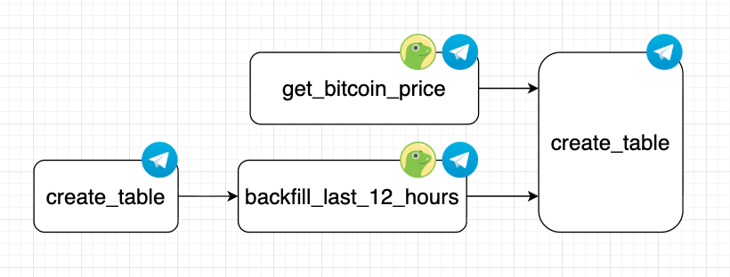
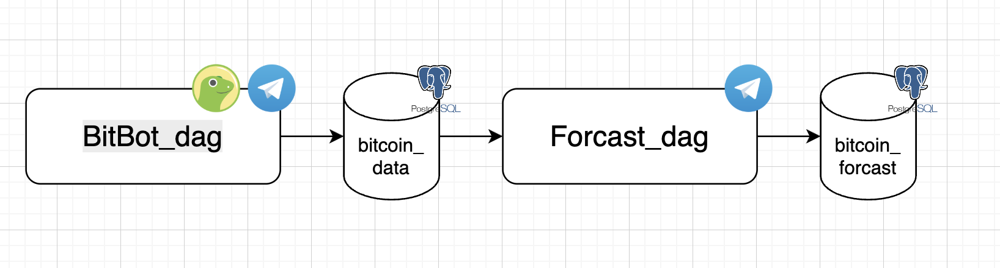

# BitBot Airflow – Projektdokumentation

## FHNW – Simon Eich

## Problemstellung
Es existieren verschiedene Modelle zur Vorhersage von Kursverläufen. Um diese Modelle testen zu können, werden möglichst aktuelle und historische Daten benötigt. Das manuelle Sammeln dieser Daten ist jedoch aufwendig und fehleranfällig.  
Eine geeignete Möglichkeit zur Automatisierung dieses Prozesses ist der Einsatz von Apache Airflow.

Da der Prozess nicht konstant überwacht werden soll, jedoch bei auftretenden Fehlern sofort reagiert werden muss, wird zusätzlich ein Benachrichtigungssystem benötigt.

---

## Zielarchitektur (Soll-Zustand)
Die Lösung soll automatisch in regelmäßigen Intervallen einen Wert, wie den Bitcoin-Preis erfassen, in einer Datenbank speichern und bei Fehlern unmittelbar über Telegram informieren.

### Systemkomponenten
### Apache Airflow (3.1.2)
- Orchestriert den gesamten Prozess  
- Führt Tasks sequenziell und planbar aus  
- Bietet Logging und Monitoring  

### CoinGecko API
- Liefert aktuelle Bitcoin-Preise im 5-Minuten-Intervall  
- Stellt historische Werte bereit  

### PostgreSQL
- Speicherung der Preisdaten  
- Basis für Analysen oder Reporting  

### Telegram Bot
- Versendet Fehlermeldungen  
- Ermöglicht schnelle Reaktion auf Probleme  

---

## Ablaufdiagramm

create_table() >> backfill_last_12_hours() >> insert_data(get_bitcoin_price())

---

## Technologie-Entscheidungen

### Warum Apache Airflow?
Airflow eignet sich besonders für ETL-Prozesse, API-Abfragen und orchestrierte Workflows.  
Vorteile:
- Wiederholbare, planbare Ausführung  
- Native PostgreSQL-Anbindung (PostgresHook)  
- Skalierbarkeit  
Für diese Anwendung ist Airflow geeigneter als Apache Beam, da keine Datenströme, sondern zeitgesteuerte Abläufe benötigt werden.

### Warum Docker Compose?
- Einfach erweiterbar (zusätzliche Services oder Worker)  
- Industriestandard für lokale und produktionsnahe Umgebungen  

### Warum PostgreSQL?
- Stabile, relationale Datenbank  
- Airflow liefert fertige Hooks/Operatoren  
- Gut geeignet für spätere Auswertungen
- Ideal für Zeitreihendaten  

### Warum Telegram?
- Leicht integrierbar  
- Kostenlos und zuverlässig  
- Ideal für mobile Benachrichtigungen (Plattformunabhängig)  

---

## Umsetzung

Der Airflow-DAG umfasst vier Haupttasks:

### 1. create_table()
- Erstellt die Tabelle `bitcoin_data`, falls sie noch nicht existiert  
- Ermöglicht einen idempotenten Start auf leeren Systemen  

### 2. backfill_last_12_hours()
- Füllt die letzten zwölf Stunden an Preisdaten nach  

### 3. get_bitcoin_price()
- Ruft den aktuellen Bitcoin-Preis über die CoinGecko-API ab  

### 4. insert_data(price)
- Speichert den Preis in der PostgreSQL-Datenbank  

### Telegram-Error-Handling
- Jeder Task ist in einen try/except-Block eingebettet  
- Bei Fehlern wird automatisch eine Telegram-Nachricht versendet  

Dies macht Probleme sofort sichtbar, etwa wenn:
- die API nicht erreichbar ist  
- die Datenbank nicht reagiert  
- Airflow fehlschlägt  

---

## Quickstart

### Projekt starten
1. Repository klonen  
2. Mit folgendem Befehl starten:  

`docker compose up`

### Airflow aufrufen  
- URL: http://localhost:8080/  
- Login:
- Benutzer: `airflow`  
- Passwort: `airflow`  

---

### Fazit/Ausblick

Der BitBot-DAG automatisiert die zuvor manuelle und fehleranfällige Erfassung von Bitcoin-Daten vollständig und erhöht dank Telegram-Benachrichtigungen die Reaktionsfähigkeit bei Problemen. Airflow sorgt für eine zuverlässige, nachvollziehbare Verarbeitung und schafft eine stabile Grundlage für weitere Analysen.

Für die Zukunft bietet das System zahlreiche Erweiterungsmöglichkeiten. Im Bereich des BitBot-DAG zur Datensammlung könnten beispielsweise zusätzliche Kryptowährungen wie Ethereum oder Solana integriert werden. Ebenso wäre der Einsatz weiterer APIs zur Validierung und Absicherung der Datenqualität sinnvoll. Darüber hinaus könnte ein automatisiertes Backfilling eingerichtet werden, um Datenlücken bei kurzfristigen Ausfällen zuverlässig zu schließen.

Auch der Forecast-DAG lässt sich weiterentwickeln, etwa durch den Einsatz präziserer Modelle wie Auto-ARIMA oder Prophet. Ergänzend könnten Visualisierungen, Dashboards oder erweiterte Benachrichtigungen integriert werden, um Trends schneller zu erkennen und besser auszuwerten.

